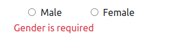

# Forms Validation Example 

Angular provides two different approaches to handling user input through forms: reactive and template-driven.

- **Template Driven Form**
  - In this kind of form, we can write the forms in Angular template syntax with form syntax directives.
- **Reactive Form**
  - Reactive forms provide a model-driven approach to handling form inputs whose values change over the time.

- In this application we are using `Bootstrap 5` for designing forms.

### 1 Template Driven Form

Template-driven forms rely on `directives` in the template to create and manipulate the underlying object model. They are useful for adding a simple form to an app, such as an email list signup form. They're **easy to add** to an app, but they don't scale as well as reactive forms. If you have very basic form requirements and logic that can be managed solely in the template, template-driven forms could be a good fit.


#### 1.1 Form Setup

- To work with Template-driven forms, we must import the `FormsModule` in root module or in a shared module.

```js
import { FormsModule } from "@angular/forms";

@NgModule({
  imports: [
    BrowserModule,
    FormsModule    // Add this module for use template-driven forms  
  ]
})
export class AppModule { }
```

- Create form with Template-Driven approach.
```js
<form  #validationForm="ngForm" (ngSubmit)="onSubmit(validationForm)">

  <div class="form-group m-3">
      <label for="username">Username</label>
      <input type="email" class="form-control m-2"
          [ngClass]="{'border border-danger': usernameField.touched && !usernameField.valid}" id="username"
          name="username" #usernameField="ngModel" [(ngModel)]="username" placeholder="Enter email" required>
      <div *ngIf="usernameField.touched && usernameField.invalid && usernameField.errors?.required"
          class="text-danger">Username is required</div>
  </div>
  
  <button type="submit" class="btn btn-primary m-3" [disabled]="!validationForm.form.valid">Submit</button>

</form>
```
- In above snippet we are declaring the form with name `validationForm` and to bind form element in template driven we have to assign a name to our form element and also give a directive `ngModel` to that same form element.

#### 1.2 Validate Form

- To validate form we can use property `valid` of **NgForm** which give us the boolean value either form is valid or not. 
```js
  validationForm.form.valid
```
- To ensure validity of any perticular field we can assign **ngModel** reference to any form field as given below :
```js
 #usernameField="ngModel"
```
and we can check for some properties of that form field like touched, dirty, valid, invalid, error, etc.where **errors** gives the object of key-value pairs for error like `{"required": true}` and other propertes return the boolean value `true | false`.
```js 
usernameField.touched           // return true|false 
usernameField.invalid           // return true|false 
usernameField.errors            // return "minlength": { "requiredLength": 8, "actualLength": 1 } | {"required": true}
usernameField.errors?.required  // return true|false 
```

#### 1.3 Template Driven Form Example 

- Input Field
```js
<div class="form-group m-3">
    <label for="username">Username</label>
    <input type="email" class="form-control m-2"
        [ngClass]="{'border border-danger': usernameField.touched && !usernameField.valid}" id="username"
        name="username" #usernameField="ngModel" [(ngModel)]="username" placeholder="Enter email" required>
    <div *ngIf="usernameField.touched && usernameField.invalid && usernameField.errors?.required"
        class="text-danger">Username is required</div>
</div>
```


- Email Field
```js
<div class="form-group m-3">
    <label for="email">Email address</label>
    <input type="email" class="form-control m-2"
        [ngClass]="{'border border-danger': emailField.touched && !emailField.valid}" id="email"
        aria-describedby="emailHelp" name="email" #emailField="ngModel" [(ngModel)]="email"
        placeholder="Enter email" required>
    <div *ngIf="emailField.touched && emailField.invalid && emailField.errors?.required" class="text-danger">
        Email is required</div>
</div>
```


- Password Field
```js
<div class="form-group m-3">
    <label for="password">Password</label>
    <input type="password" class="form-control m-2"
        [ngClass]="{'border border-danger': passwordField.touched && !passwordField.valid}" id="password"
        placeholder="Password" name="password" [(ngModel)]="password" #passwordField="ngModel" minlength="8"
        required>
    <div *ngIf="passwordField.touched && passwordField.invalid" class="text-danger">Password is not valid</div>
</div>
```


- Select Field
```js
<div class="form-group m-3">
    <label for="experience">Experience</label>
    <select name="title" class="form-control m-2" [(ngModel)]="select" #experience="ngModel" id="experience"
        [ngClass]="{ 'is-invalid':experience.touched && experience.invalid }" required>
        <option disabled selected>Choose your Experience</option>
        <option *ngFor=" let item of selectOptionsValues" [value]="item">{{item + ' yr'}}</option>
    </select>
    <div *ngIf=" experience.invalid" class="invalid-feedback">
        <div *ngIf="experience.touched && experience.errors.required">Experience is required</div>
    </div>
</div>
```


- Checkbox Button

```js
<div class="form-group m-3">
    <div class="form-check form-check-inline">
        <input class="form-check-input m-1" type="checkbox" id="feature" value="true" name="feature"
            [ngClass]="{'border border-danger': featured.touched && featured.invalid}" #featured="ngModel"
            [(ngModel)]="isFeatured" required>
        <label class="form-check-label" for="feature">Yes,Ofcourse</label>
    </div>
    <div *ngIf="featured.touched && featured.invalid" class="text-danger">Feature is invalid</div>
</div>
```


- Radio Button

```js
<div class="form-group m-3">
    <div class="form-check form-check-inline">
        <input type="radio" value="male" name="gender" [(ngModel)]='gender' required #genderValude="ngModel">
        Male
    </div>
    <div class="form-check form-check-inline">
        <input type="radio" value="female" name="gender" [(ngModel)]='gender' required #genderValude="ngModel">
        Female
    </div>
    <div *ngIf="genderValude.invalid" class="text-danger">Gender is invalid</div>
</div>
```



- Textarea Field
```js
<div class="form-group m-3">
    <label for="description">Description</label>
    <textarea class="form-control m-2" id="description" name="description" [(ngModel)]="description"
        #descriptionField="ngModel" rows="3" required
        [ngClass]="{'border border-danger': descriptionField.touched &&  descriptionField.invalid}"></textarea>
    <div *ngIf="descriptionField.touched && descriptionField.invalid" class="text-danger">Description is invalid
    </div>
</div>
```


- Upload File

```js
<div class="form-group m-3">
    <label for="fileUpload ">Uplaod CV</label>
    <input type="file" class="form-control-file m-2" id="fileUpload" name="uploadFile" [(ngModel)]="uploadFile"
        #fileUpload="ngModel" required>
    <div *ngIf="fileUpload.touched && fileUpload.invalid" class="text-danger">File is invalid</div>
</div>
```


### 2 Reactive Form

Angular reactive forms follow a model-driven approach to handle form input whose values can be changed over time. These are also known as model-driven forms. In reactive forms, you can create and update a simple form control, use multiple controls in a group, validate form values, and implement more advanced form


#### 2.1 Form Setup

- To work with Reactive forms, we must import the `ReactiveFormsModule` in root module or in a shared module.

```js
import { ReactiveFormsModule } from "@angular/forms";

@NgModule({
  imports: [
    BrowserModule,
    ReactiveFormsModule    // Add this module for use reactive forms  
  ]
})
export class AppModule { }
```

- Create form with Template-Driven approach.
  - First create Form in component file `(reactive.component.ts)`
```js
generateForm() {
  // create form using form-builder
  this.reactiveForm = this.formBuilder.group({
    username: ['', Validators.required],
    email: ['', [Validators.email, Validators.required]],
    password: ['', [Validators.required, Validators.minLength(8)]],
    experienceYear: ['', Validators.required],
    isFeatured: [false, Validators.requiredTrue],
    gender: ['', Validators.required],
    description: ['', Validators.required],
    fileUpload: ['', Validators.required]
  });
}
```
  - And bind that form to template`(reactive.component.html)` using `formGroup`

```js
<form [formGroup]="reactiveForm" (ngSubmit)="submitForm()">

  <div class="form-group m-3">
      <label for="username">Username</label>
      <input type="text" id="username" class="form-control" formControlName="username"
          [ngClass]="{'border border-danger': formSubmitted && reactiveForm.controls.username.errors }">
      <span class="text-danger" *ngIf="formSubmitted && reactiveForm.controls.username.errors ">Username is not
          valid</span>
  </div>
  
  <button type="submit" [disabled]="!reactiveForm.valid">submit</button>

</form>
```
  - In above snippet we are declaring the form with name `reactiveForm` and to bind form element in reactive we have to assign `formControlName` to that form element.

#### 2.2 Validate Form
To validate form we can use property valid of **FormGroup** which give us the boolean value either form is valid or not as same as template-driven approach.
```js
reactiveForm.valid
```
To ensure validity of any perticular field we can use the properties of form-control of that field as given below :
```js 
formControlName="username"
```
and we can check for some properties of that form field like touched, dirty, valid, invalid, error, etc.where errors gives the object of key-value pairs for error like **{"required": true}** and other properties return the boolean value `true | false`.
```js
reactiveForm.controls.username.touched           // return true|false 
reactiveForm.controls.username.invalid           // return true|false 
reactiveForm.controls.username.errors            // return "minlength": { "requiredLength": 8, "actualLength": 1 } | {"required": true}
reactiveForm.controls.username.errors?.required  // return true|false 
```


#### 2.3 Template Driven Form Example 

- Input Field
```js
 <div class="form-group m-3">
    <label for="username">Username</label>
    <input type="text" id="username" class="form-control" formControlName="username"
        [ngClass]="{'border border-danger': formSubmitted && reactiveForm.controls.username.errors }">
    <div *ngIf="reactiveForm.controls.username.errors">
        <span class="text-danger"
            *ngIf="formSubmitted  && reactiveForm.controls.username.errors.required ">Username is
            reuired</span>
        <span class="text-danger"
            *ngIf="formSubmitted && !reactiveForm.controls.username.valid &&  !reactiveForm.controls.username.errors.required ">Username
            is not
            valid</span>
    </div>
</div>
```


- Email Field
```js
<div class="form-group m-3">
    <label for="email">Email</label>
    <input type="email" id="email" class="form-control" formControlName="email"
        [ngClass]="{'border border-danger': formSubmitted && reactiveForm.controls.email.errors }">
    <div *ngIf="reactiveForm.controls.email.errors">
        <span class="text-danger" *ngIf="formSubmitted && reactiveForm.controls.email.errors.required">Email is
            required</span>
        <span class="text-danger"
            *ngIf="formSubmitted && reactiveForm.controls.email.errors && !reactiveForm.controls.email.errors.required">Email
            is not valid</span>
    </div>
</div>
```


- Password Field
```js
<div class="form-group m-3">
    <label for="password">Password</label>
    <input type="password" id="password" class="form-control" formControlName="password"
        [ngClass]="{'border border-danger': formSubmitted && reactiveForm.controls.password.errors }">
    <div *ngIf="reactiveForm.controls.password.errors">
        <span class="text-danger"
            *ngIf="formSubmitted && reactiveForm.controls.password.errors.required">Password
            is required</span>
        <span class="text-danger"
            *ngIf="formSubmitted && reactiveForm.controls.password.errors.minlength">Password
            length is not
            valid</span>
    </div>
</div>
```


- Select Field
```js
<div class="form-group m-3">
    <label for="experience">Experience</label>
    <select formControlName="experienceYear" class="form-control"
        [ngClass]="{'border border-danger': formSubmitted && reactiveForm.controls.experienceYear.errors }">
        <option *ngFor="let item of selectOptionsValues" [ngValue]="item">{{ item + ' yr' }}</option>
    </select>
    <div *ngIf="reactiveForm.controls.experienceYear.errors">
        <span class="text-danger"
            *ngIf="formSubmitted && reactiveForm.controls.experienceYear.errors.required">Experience is
            required</span>
    </div>
</div>
```


- Checkbox Button

```js
<div class="form-group m-3">
    <div class="form-check form-check-inline">
        <input type="checkbox" id="feature" class="form-check-input" formControlName="isFeatured"
            [ngClass]="{'border border-danger': formSubmitted && reactiveForm.controls.isFeatured.errors }">
        <label class="form-check-label" for="feature">Yes,Ofcourse</label>
    </div>
    <span class="text-danger" *ngIf=" formSubmitted && reactiveForm.controls.isFeatured.errors">Experience is
        required</span>
</div>
```


- Radio Button

```js
<div class="form-group m-3">
    <div class="form-check form-check-inline">
        <input id="male" type="radio" value="male" formControlName="gender">
        <label for="male" class="mx-2">Male</label>
    </div>
    <div class="form-check form-check-inline">
        <input id="female" type="radio" value="female" formControlName="gender">
        <label for="female" class="mx-2">Female</label>
    </div>
    <div *ngIf="reactiveForm.controls.gender.errors">
        <span class="text-danger" *ngIf="formSubmitted && reactiveForm.controls.gender.errors.required">Gender
            is
            required</span>
    </div>
</div>
```


- Textarea Field
```js
<div class="form-group m-3">
    <label for="description">Description</label>
    <textarea class="form-control m-2" id="description" name="description" formControlName="description"
        [ngClass]="{'border border-danger': formSubmitted && reactiveForm.controls.description.errors }"
        rows="3"></textarea>
    <div *ngIf="reactiveForm.controls.description.errors">
        <span class="text-danger"
            *ngIf="formSubmitted && reactiveForm.controls.description.errors.required">Description is
            required</span>
    </div>
</div>
```


- Upload File

```js
<div class="form-group m-3">
    <label for="fileUpload ">Uplaod CV</label>
    <input type="file" class="form-control-file m-2" id="fileUpload" name="uploadFile"
        formControlName="fileUpload"
        [ngClass]="{'border border-danger': formSubmitted && reactiveForm.controls.fileUpload.errors }">
    <div *ngIf="reactiveForm.controls.fileUpload.errors">
        <span class="text-danger"
            *ngIf="formSubmitted && reactiveForm.controls.fileUpload.errors.required">FileUpload is
            required</span>
    </div>
</div>
```


